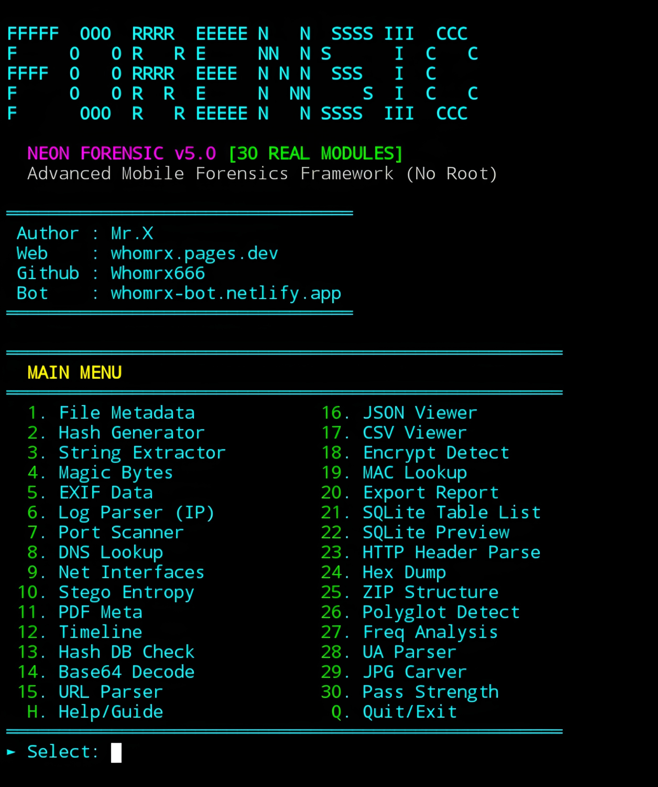

# FORENSIC


<p align="center">
  <strong>Advanced Digital Forensics CLI for Termux (No Root)</strong><br>
  <em>"Real Operations: Binary Parsing, SQL Analysis, Cryptography, Network Stats." — Mr.X</em>
</p>

## Introduction
**FORENSIC** is a powerful **digital forensics framework** designed specifically for mobile and terminal environments. With **30 real forensic modules**, it enables deep file analysis, network reconnaissance, metadata extraction, steganography detection, and more—all without requiring root access. Built with a sleek **cyberpunk neon terminal interface**, it runs smoothly on **Termux (Android)**, Linux, and other Python-supported platforms.

---

## Installation
```bash
$ pkg update -y && pkg upgrade -y
$ pkg install git python -y
$ git clone https://github.com/Whomrx666/Forensic.git
$ cd neonforensic
$ chmod +x forensic.py
$ python3 install.py

```
## Run manually
```
$ python3 forensic.py
```

## Features
-**30 Real Forensic Modules** – From file hashing to SQLite analysis, entropy checks, and JPG carving.
-**Termux Optimized** – Fully functional on Android with no root required.
-**Cyberpunk UI** – Neon-themed terminal with animated boot screen, two-column menu, and clean output formatting.
-**Export Reports** – Generate session reports in JSON or CSV format (Module 20).
-**Binary & File Analysis** – Hex dumps, magic bytes, polyglot detection, EXIF/PDF metadata, and string extraction.
-**Network Tools** – Port scanning (with custom ranges), DNS lookup, HTTP header parsing, MAC vendor lookup.
-**Cryptography & Security** – Hash generation (MD5/SHA1/SHA256), Base64 decode, password strength testing, Chi-square encryption detection.

## Instructions
- **First**: Install the tool using the commands above.
- **Second**: Run  python3 forensic.py  to launch the cyberpunk interface.
- **Third**: Select a module by number (1–30), press  H  for detailed help, or  Q  to quit.
- **Fourth**: Follow prompts (e.g., file paths, IPs, passwords) based on the chosen module.
- **Fifth**: Review results displayed in color-coded, structured output.
- **Last**: Use Module 20 to export your forensic session report.

## Observation
This tool is intended for **educational and ethical hacking purposes only**. Unauthorized scanning of systems you do not own or have explicit permission to test is illegal. The author assumes no responsibility for misuse or damage caused by this tool.

### Original Author
<a href="https://github.com/Whomrx666"></a>

### <<< If you copy , Then Give me The Credits >>>

## CONNECT WITH ME :

[](https://whomrxhackers.blogspot.com/)
[](https://twitter.com/whomrx666)
[](https://wa.me/6285926601133?text=Halo%2C%20Mr.X)
[](https://www.facebook.com/whomrx.666)
[](https://t.me/Whomr_X)
[](mailto:whomrx666@gmail.com)
[](https://www.tiktok.com/@whomr.x)

**If you want to donate, click on the button**
<a href="https://saweria.co/whomrx"></a>

---

<p align="left">
  
</p>

---